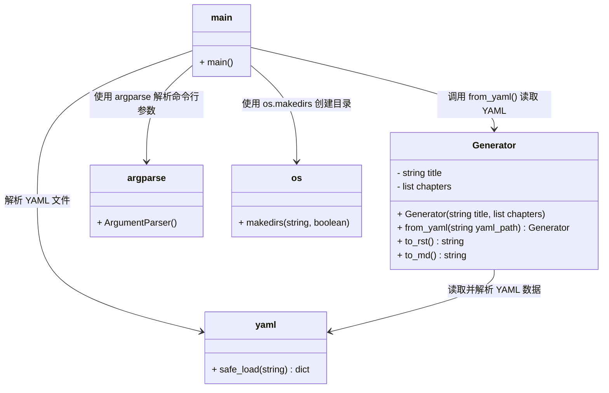

```mermaid
classDiagram
    class Generator {
        - string title
        - list chapters
        + Generator(string title, list chapters)
        + from_yaml(string yaml_path) Generator
        + to_rst() string
        + to_md() string
    }

    class main {
        + main()
    }

    class argparse {
        + ArgumentParser()
    }

    class yaml {
        + safe_load(string) dict
    }

    class os {
        + makedirs(string, boolean)
    }

    main --> argparse : 使用 argparse 解析命令行参数
    main --> os : 使用 os.makedirs 创建目录
    main --> Generator : 调用 from_yaml() 读取 YAML
    main --> yaml : 解析 YAML 文件
    Generator --> yaml : 读取并解析 YAML 数据
```
